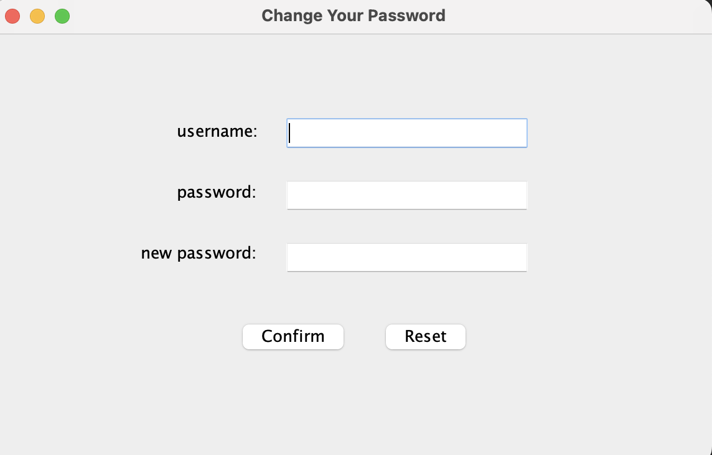
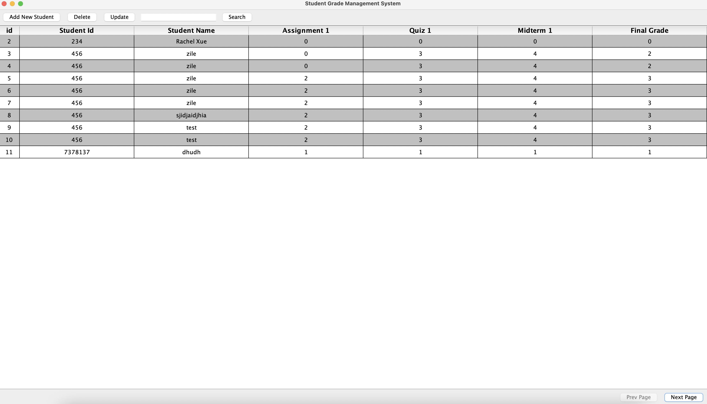

# Student_Grade_Management_System

## Description
This is a student grade management system implemented with java-swing and mysql database.
We use Jframe in java-swing to build our whole system. We also connect with
mysql database to support store/update data of user's/student's information.

## Features of this project
- Login view

Our student management system support login/register/reset password functions.
To log in the system, simply type in your username and password.

  

Make sure we use the correct username/password that matches record in database
, otherwise we cannot log in successfully.

User can create a new account or reset their password if needed.

- Main view

Once we log in successfully, we can see the main view of our management system.
The system support different types of functions like add new student, search for student
, update and delete.

To add a student, simply click the add new student button on the main view, and type in the student information,
the data will automatically store in the database.

To search for a student, type the student's name in the text field and click the search button once you are done.

## Database
We use mysql database to store our data. We used two tables here one is called user_info.
We use it to store for the user's username/password for log in. 
The other one is student_info which used for store student's data that user imported.
